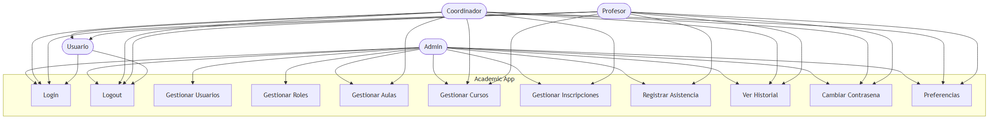

```
graph LR

    %% Definición de Actores

    U(("Usuario General"))

    C(("Coordinador"))

    P(("Profesor"))

    %% Casos de Uso del Usuario General

    subgraph CU_User ["Módulo Base / General"]

        CU01(["CU-01: Login"])

        CU06(["CU-06: Logout"])

    end

    %% Casos de Uso del Coordinador

    subgraph CU_Coord ["Módulo Administración (Coordinador)"]

        CU02(["CU-02: Crear Curso"])

        CU03(["CU-03: Crear Aula"])

        CU05(["CU-05: Registrar Inscripción"])

    end

    %% Casos de Uso del Profesor

    subgraph CU_Prof ["Módulo Académico (Profesor)"]

        CU04(["CU-04: Registrar Asistencia"])

    end

    %% Relaciones: Coordinador

    C --> CU02

    C --> CU03

    C --> CU05

    %% Relaciones: Usuario General

    U --> CU01

    U --> CU06

    %% Relaciones: Profesor

    P --> CU04

    P --> CU02

    P --> CU03
```