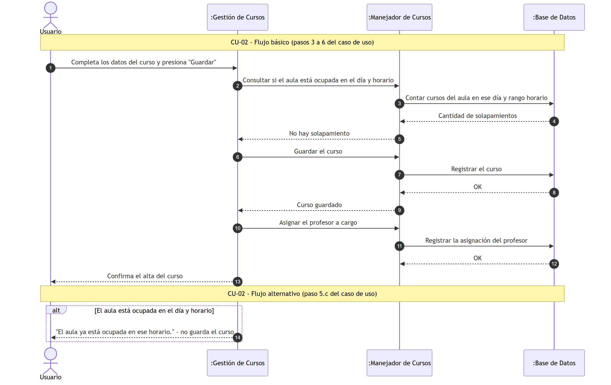
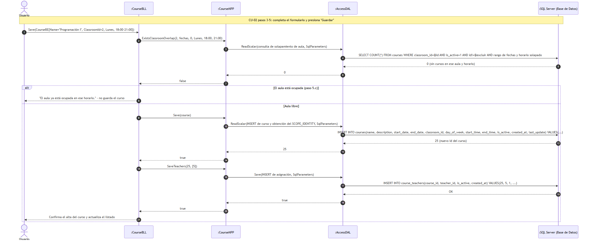
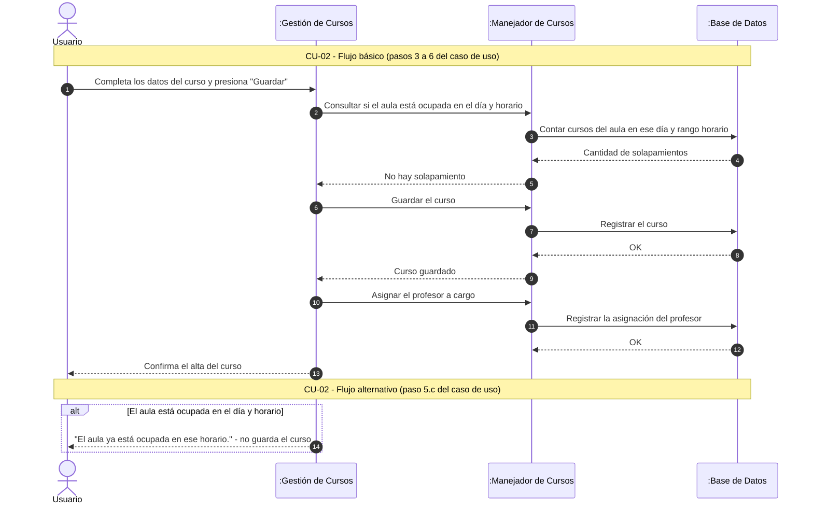

#### 4.2. Especificación de Casos de Uso: CU-02 Crear Curso

#### 4.2.1. Carátula

| Campo | Valor |
| :--- | :--- |
| **ID y Nombre** | CU-02 Crear Curso |
| **Estado** | En Revisión |
| **Descripción** | Permite al Coordinador o Profesor registrar un nuevo curso dentro del sistema, asignándole nombre, descripción, fecha de inicio y fin, aula y hora de inicio y fin, y profesor a cargo. |
| **Actor Principal** | Coordinador, Profesor |
| **Actores Secundarios** | Ninguno |
| **Precondiciones** | El usuario debe haber iniciado sesión con el rol correspondiente. |
| **Punto de extensión** | No aplica |
| **Condición** | Datos obligatorios válidos y nombre de curso no duplicado |

#### 4.2.2. Historial de Revisiones

| Versión | Fecha | Descripción | Autor |
| :--- | :--- | :--- | :--- |
| 1.0 | 13/09/2026 | Creación inicial de la especificación del Caso de Uso | Darío Zubaray |

#### 4.2.3. Objetivo

Permitir el alta de un nuevo curso en el sistema para que quede disponible en la oferta académica e inscripciones.

#### 4.2.4. Precondiciones

- El usuario debe estar autenticado como Coordinador o Profesor.
- El sistema debe contar con aulas y profesores registrados para asociar al curso.

#### 4.2.5. Puntos de Extensión y Condiciones

- **Punto de Extensión:** No aplica.
- **Condición:** Los datos ingresados cumplen las reglas de validación y el nombre no se encuentra registrado previamente.

#### 4.2.6. Descripción analítica del Caso de Uso

Flujo Básico:
1. El usuario (Coordinador o Profesor) accede al formulario "Cursos" del menú "Administración" y selecciona "Nuevo".
2. El sistema muestra el formulario de alta de curso con sus campos.
3. El usuario completa los campos: nombre del curso, descripción, fecha de inicio, fecha de fin, aula, día de dictado, hora de inicio y hora de fin.
4. El usuario selecciona en el campo "Profesor a cargo" al docente responsable del curso.
5. El usuario presiona el botón "Guardar".
6. El sistema confirma el alta del curso mediante un mensaje de éxito y muestra el curso en el listado.

Flujos Alternativos:
- **5.a Datos obligatorios incompletos o inválidos:**
  1. El sistema muestra un mensaje de advertencia indicando los campos con errores.
  2. El usuario corrige los datos señalados y vuelve a presionar "Guardar".
- **5.b Nombre de curso duplicado:**
  1. El sistema informa que ya existe un curso registrado con ese nombre.
  2. El usuario modifica el nombre y vuelve a presionar "Guardar".
- **5.c Profesor asignado a otro curso en el mismo día y horario:**
  1. El sistema informa que el profesor ya se encuentra dictando en ese día y horario.
  2. El usuario selecciona otro profesor u otro horario y vuelve a presionar "Guardar".

#### 4.2.7. Modelo de Dominio

Participan las siguientes entidades:
- Curso
- Aula
- Profesor
- Coordinador

#### 4.2.8. Diagramas de Secuencia

Diagrama simple: 

Diagrama detallado: 

