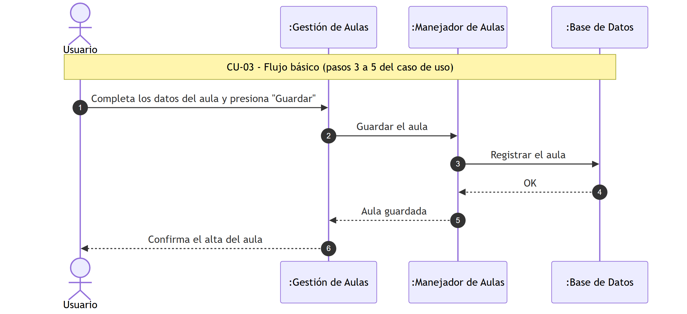
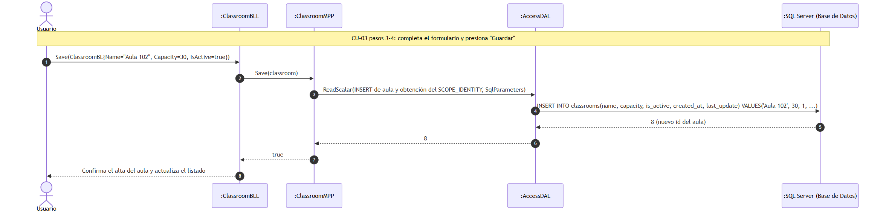
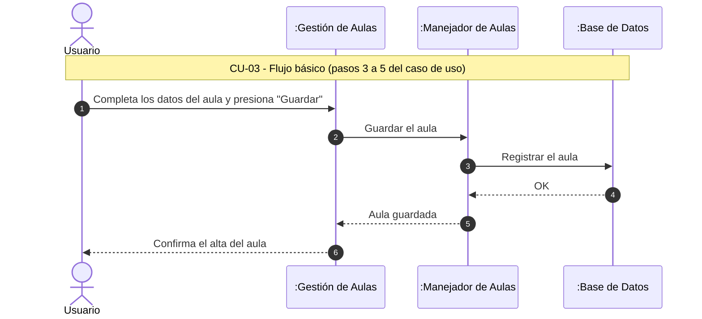

#### 4.3. Especificación de Casos de Uso: CU-03 Crear Aula

#### 4.3.1. Carátula

| Campo | Valor |
| :--- | :--- |
| **ID y Nombre** | CU-03 Crear Aula |
| **Estado** | En Revisión |
| **Descripción** | Permite registrar un espacio físico (aula) especificando su nombre y capacidad para ser asignado a comisiones o cursos. |
| **Actor Principal** | Coordinador, Profesor |
| **Actores Secundarios** | Ninguno |
| **Precondiciones** | El usuario debe haber iniciado sesión con el rol autorizado. |
| **Punto de extensión** | No aplica |
| **Condición** | Identificador de aula único |

#### 4.3.2. Historial de Revisiones

| Versión | Fecha | Descripción | Autor |
| :--- | :--- | :--- | :--- |
| 1.0 | 13/09/2026 | Creación inicial de la especificación del Caso de Uso | Darío Zubaray |

#### 4.3.3. Objetivo

Dar de alta una nueva aula dentro de la academia.

#### 4.3.4. Precondiciones

- El usuario se encuentra autenticado con perfil de Coordinador o Profesor.

#### 4.3.5. Puntos de Extensión y Condiciones

- **Punto de Extensión:** No aplica.
- **Condición:** El número o nombre del aula no está duplicado.

#### 4.3.6. Descripción analítica del Caso de Uso

Flujo Básico:
1. El usuario accede al formulario "Aulas" del menú "Administración" y selecciona "Nuevo".
2. El sistema muestra el formulario de alta de aula.
3. El usuario completa los campos: identificación (ej. "Aula 102") y capacidad máxima de alumnos.
4. El usuario presiona el botón "Guardar".
5. El sistema confirma el alta del aula mediante un mensaje de éxito y actualiza el listado de aulas.

Flujo Alternativo:
- **4.a Identificación de aula duplicada:**
  1. El sistema muestra un mensaje indicando que ya existe un aula con esa identificación.
  2. El usuario modifica la identificación y vuelve a presionar "Guardar".

#### 4.3.7. Modelo de Dominio

Participan las siguientes entidades:
- Aula
- Coordinador
- Profesor

#### 4.3.8. Diagramas de Secuencia

Diagrama simple: 

Diagrama detallado: 

