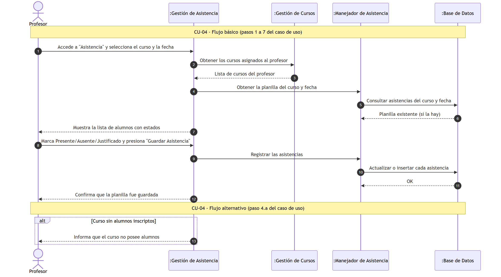
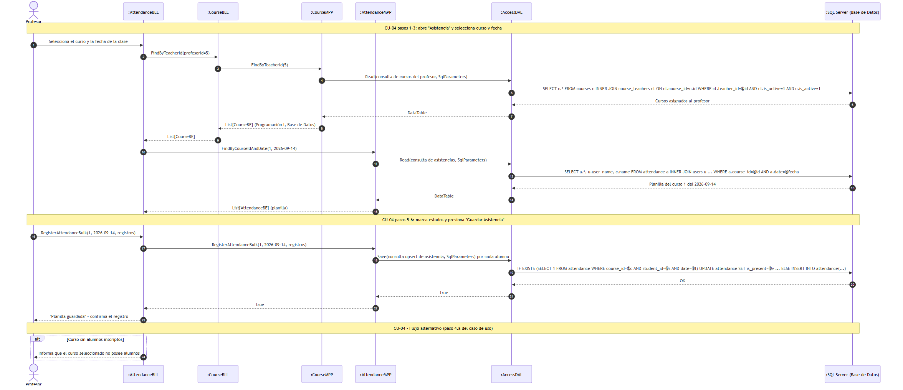
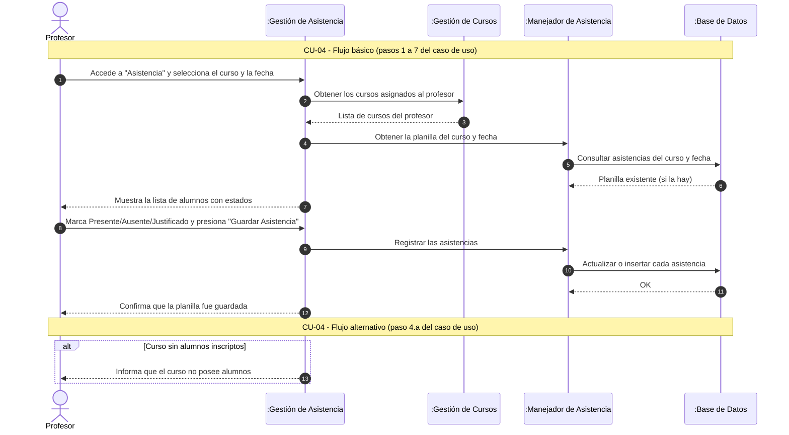

#### 4.4. Especificación de Casos de Uso: CU-04 Registrar Asistencia

#### 4.4.1. Carátula

| Campo | Valor |
| :--- | :--- |
| **ID y Nombre** | CU-04 Registrar Asistencia |
| **Estado** | En Revisión |
| **Descripción** | Permite al Profesor registrar el estado de asistencia (Presente, Ausente, Justificado) para cada alumno matriculado en una clase específica. |
| **Actor Principal** | Profesor |
| **Actores Secundarios** | Ninguno |
| **Precondiciones** | El curso debe tener alumnos inscriptos y la fecha debe corresponder a un día de dictado. |
| **Punto de extensión** | No aplica |
| **Condición** | Selección de curso y fecha válida |

#### 4.4.2. Historial de Revisiones

| Versión | Fecha | Descripción | Autor |
| :--- | :--- | :--- | :--- |
| 1.0 | 13/09/2026 | Creación inicial de la especificación del Caso de Uso | Darío Zubaray |

#### 4.4.3. Objetivo

Asentar la asistencia por clase de los estudiantes inscriptos en un determinado curso a cargo del docente.

#### 4.4.4. Precondiciones

- El profesor debe haber iniciado sesión en la aplicación.
- El profesor debe tener asignado al menos un curso con alumnos matriculados.

#### 4.4.5. Puntos de Extensión y Condiciones

- **Punto de Extensión:** No aplica.
- **Condición:** El profesor confirma la planilla de asistencia.

#### 4.4.6. Descripción analítica del Caso de Uso

Flujo Básico:
1. El Profesor accede al formulario "Asistencia" del menú "Académico".
2. El sistema presenta la lista de cursos asignados al Profesor.
3. El Profesor selecciona el curso y la fecha de la clase.
4. El sistema muestra la lista de alumnos inscriptos con el estado de asistencia de cada uno.
5. Para cada alumno, el Profesor selecciona el estado "Presente", "Ausente" o "Justificado".
6. El Profesor presiona el botón "Guardar Asistencia".
7. El sistema confirma que la planilla fue guardada con éxito.

Flujo Alternativo:
- **4.a Curso sin alumnos inscriptos:**
  1. El sistema informa que el curso seleccionado no posee alumnos inscriptos.
  2. El Profesor selecciona otro curso o cierra el formulario.

#### 4.4.7. Modelo de Dominio

Participan las siguientes entidades:
- Profesor
- Curso
- Alumno
- Asistencia

#### 4.4.8. Diagramas de Secuencia

Diagrama simple: 

Diagrama detallado: 

