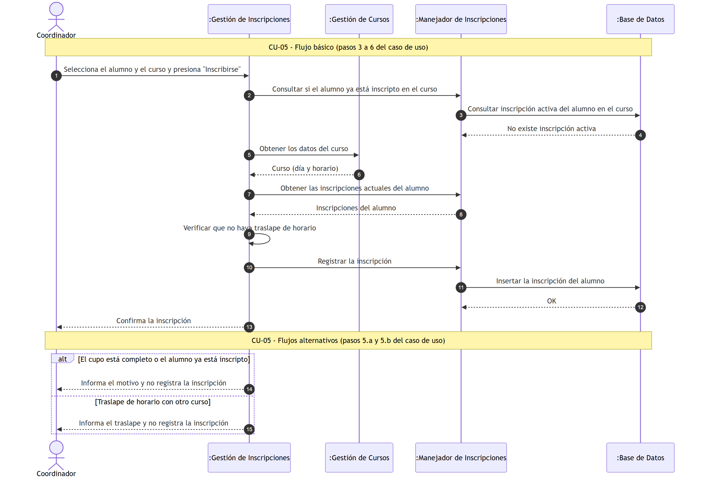
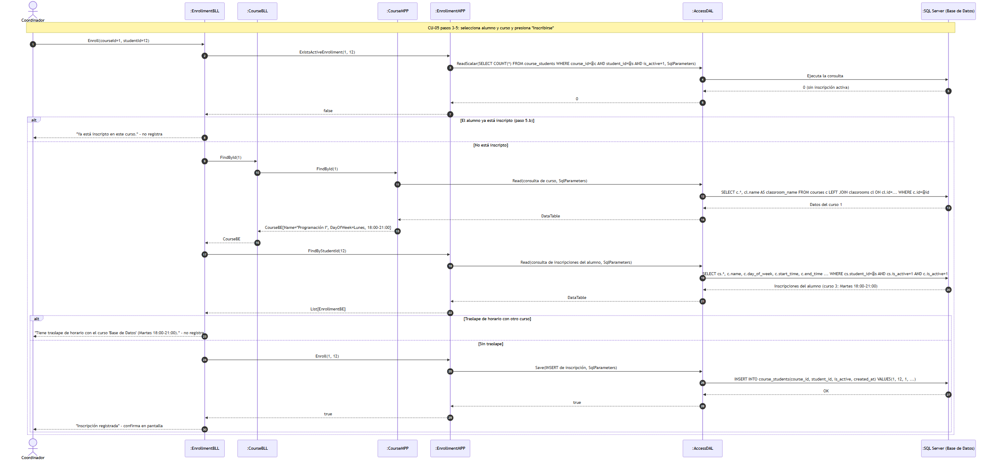
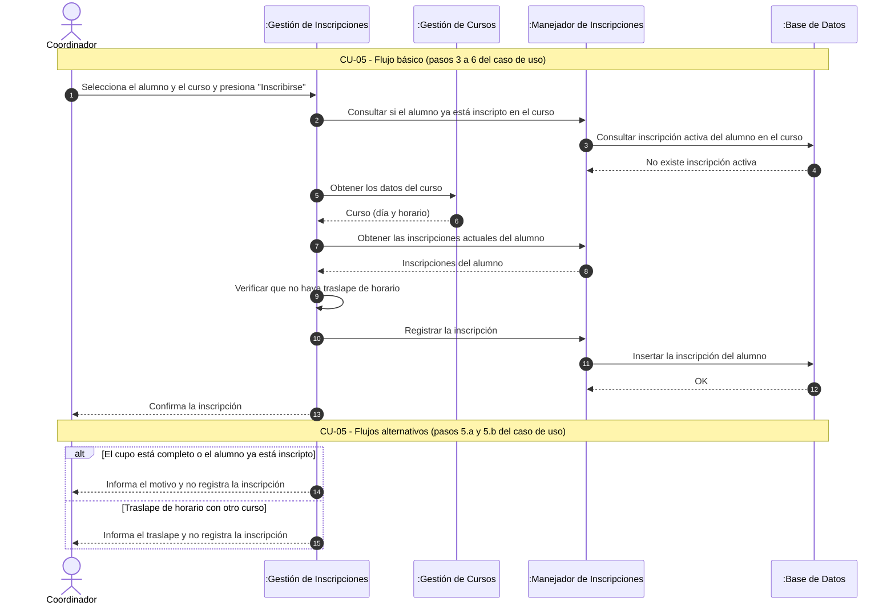

#### 4.5. Especificación de Casos de Uso: CU-05 Registrar Inscripción

#### 4.5.1. Carátula

| Campo | Valor |
| :--- | :--- |
| **ID y Nombre** | CU-05 Registrar Inscripción |
| **Estado** | En Revisión |
| **Descripción** | Permite al Coordinador registrar la inscripción de un alumno a un curso disponible, verificando previamente la disponibilidad del cupo. |
| **Actor Principal** | Coordinador |
| **Actores Secundarios** | Ninguno |
| **Precondiciones** | El Coordinador debe haber iniciado sesión y el alumno a inscribir debe estar registrado en el sistema. |
| **Punto de extensión** | No aplica |
| **Condición** | Disponibilidad de cupo en el curso seleccionado y que el alumno no se encuentre previamente inscripto |

#### 4.5.2. Historial de Revisiones

| Versión | Fecha | Descripción | Autor |
| :--- | :--- | :--- | :--- |
| 1.0 | 13/09/2026 | Creación inicial de la especificación del Caso de Uso | Darío Zubaray |
| 1.1 | 24/09/2026 | Cambio de actor: la inscripción es registrada por el Coordinador | Darío Zubaray |

#### 4.5.3. Objetivo

Registrar la inscripción de un alumno a un curso, dejándolo matriculado oficialmente en la oferta académica actual.

#### 4.5.4. Precondiciones

- El Coordinador ha iniciado sesión en el sistema.
- El alumno a inscribir se encuentra registrado en el sistema.
- Existen cursos en estado activo y con periodo de inscripción abierto.

#### 4.5.5. Puntos de Extensión y Condiciones

- **Punto de Extensión:** No aplica.
- **Condición:** Existencia de vacantes en el curso y sin superposición con otros cursos inscritos.

#### 4.5.6. Descripción analítica del Caso de Uso

Flujo Básico:
1. El Coordinador accede al formulario "Inscripciones" del menú "Académico".
2. El sistema muestra la lista de alumnos registrados y la lista de cursos vigentes.
3. El Coordinador selecciona en la lista de alumnos al alumno a inscribir.
4. El Coordinador selecciona en la lista de cursos el curso solicitado.
5. El Coordinador presiona el botón "Inscribirse".
6. El sistema confirma que la inscripción fue registrada con éxito.

Flujo Alternativo:
- **5.a Cupo agotado:**
  1. El sistema muestra el mensaje "Sin cupo disponible para el curso seleccionado".
  2. El Coordinador selecciona otro curso o cancela la operación.
- **5.b Alumno ya inscripto:**
  1. El sistema muestra el mensaje "El alumno ya se encuentra inscripto en este curso".
  2. El Coordinador selecciona otro curso o cancela la operación.

#### 4.5.7. Modelo de Dominio

Participan las siguientes entidades:
- Alumno
- Curso
- Inscripción
- Coordinador

#### 4.5.8. Diagramas de Secuencia

Diagrama simple: 

Diagrama detallado: 

