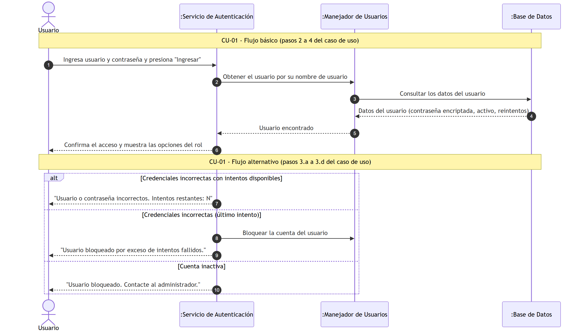
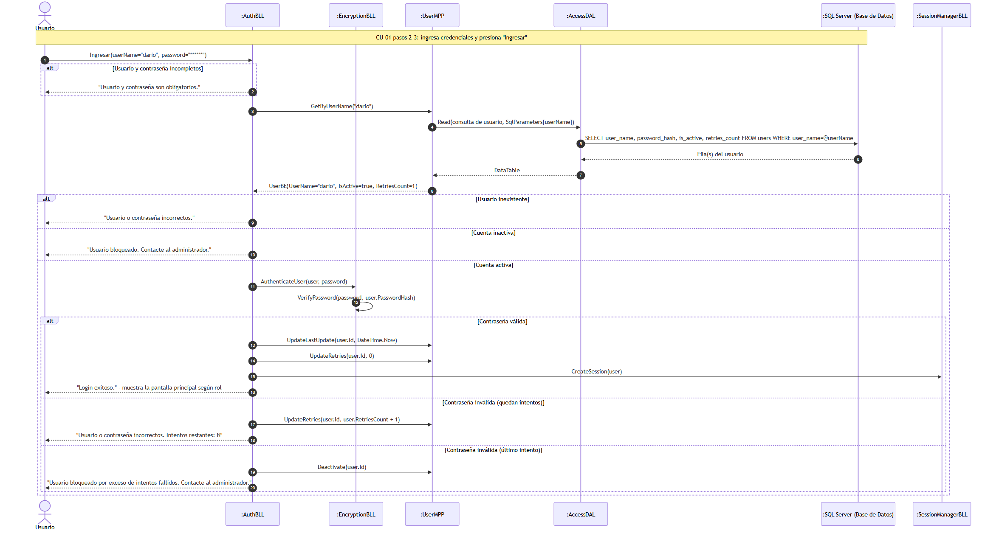
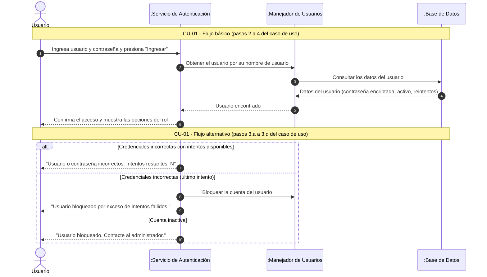

#### 6.1. Especificación de Casos de Uso: CU-01 Login

#### 6.1.1. Carátula

| Campo | Valor |
| :--- | :--- |
| **ID y Nombre** | CU-01 Login |
| **Estado** | En Revisión |
| **Descripción** | Permitir que un usuario autenticado acceda al sistema mediante el ingreso de sus credenciales. |
| **Actor Principal** | Coordinador, Profesor |
| **Actores Secundarios** | Ninguno |
| **Precondiciones** | El usuario debe estar registrado y la cuenta debe estar activa. |
| **Punto de extensión** | No aplica |
| **Condición** | Las credenciales deben ser válidas |

#### 6.1.2. Historial de Revisiones

| Versión | Fecha | Descripción | Autor |
| :--- | :--- | :--- | :--- |
| 1.0 | 13/09/2026 | Creación inicial de la especificación del Caso de Uso | Darío Zubaray |

#### 6.1.3. Objetivo

Permitir que un usuario registrado acceda a la plataforma autenticando su identidad mediante el ingreso de su nombre de usuario y contraseña.

#### 6.1.4. Precondiciones

- El usuario debe encontrarse registrado.
- La cuenta debe estar activa.
- El sistema debe encontrarse disponible.

#### 6.1.5. Puntos de Extensión y Condiciones

- **Punto de Extensión:** No aplica.
- **Condición:** Las credenciales ingresadas son válidas.

#### 6.1.6. Descripción analítica del Caso de Uso

Flujo Básico:
1. El usuario inicia el programa y se muestra la pantalla de inicio de sesión.
2. El usuario ingresa su nombre de usuario en el campo "Usuario" y su contraseña en el campo "Contraseña".
3. El usuario presiona el botón "Ingresar".
4. El sistema confirma el acceso y muestra la pantalla principal, con las opciones habilitadas según el rol del usuario (Coordinador o Profesor).
5. Fin del Caso de Uso.

Flujo alternativo:
- **3.a Campos obligatorios incompletos:**
  1. El sistema muestra el mensaje "Usuario y contraseña son obligatorios."
  2. El usuario completa los campos y vuelve a presionar "Ingresar".
- **3.b Credenciales incorrectas con intentos disponibles:**
  1. El sistema muestra el mensaje "Usuario o contraseña incorrectos. Intentos restantes: N"
  2. El usuario reingresa las credenciales y vuelve a presionar "Ingresar".
- **3.c Credenciales incorrectas en el último intento (cuenta bloqueada):**
  1. El sistema muestra el mensaje "Usuario bloqueado por exceso de intentos fallidos. Contacte al administrador." y bloquea la cuenta.
  2. Fin del Caso de Uso: la cuenta queda inactiva.
- **3.d Cuenta bloqueada al ingresar:**
  1. El sistema muestra el mensaje "Usuario bloqueado. Contacte al administrador."
  2. Fin del Caso de Uso: la cuenta permanece inactiva.

#### 6.1.7. Modelo de Dominio

Participan las siguientes entidades:
- Usuario
- Rol
- Permiso

#### 6.1.8. Diagramas de Secuencia

Diagrama simple: 

Diagrama detallado: 

