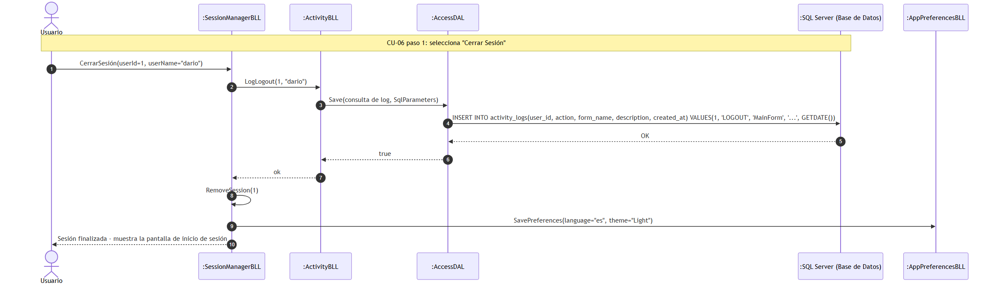
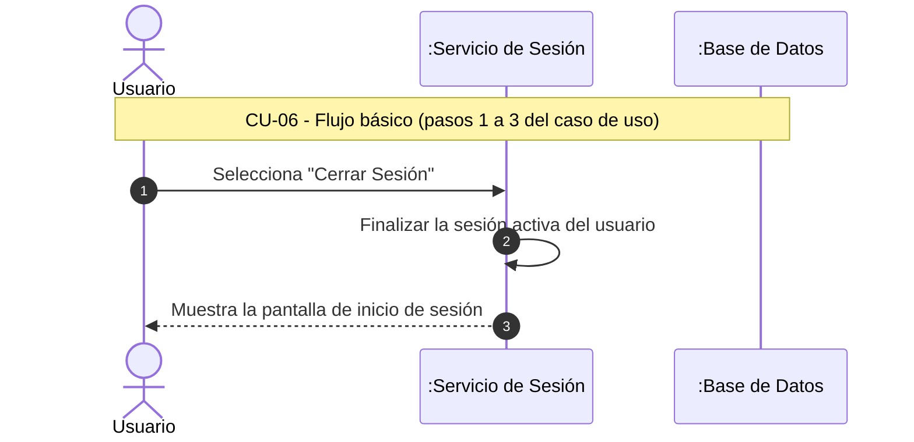

#### 6.2. Especificación de Casos de Uso: CU-06 Logout

#### 6.2.1. Carátula

| Campo | Valor |
| :--- | :--- |
| **ID y Nombre** | CU-06 Logout |
| **Estado** | En Revisión |
| **Descripción** | Permitir que un usuario finalice su sesión en la plataforma de forma segura. |
| **Actor Principal** | Coordinador, Profesor |
| **Actores Secundarios** | Ninguno |
| **Precondiciones** | El usuario debe haber iniciado sesión previamente. |
| **Punto de extensión** | No aplica |
| **Condición** | Existe una sesión activa del usuario. |

#### 6.2.2. Historial de Revisiones

| Versión | Fecha | Descripción | Autor |
| :--- | :--- | :--- | :--- |
| 1.0 | 13/09/2026 | Creación inicial de la especificación del Caso de Uso | Darío Zubaray |

#### 6.2.3. Objetivo

Permitir que un usuario cierre su sesión de forma segura, finalizando el acceso al sistema y evitando el uso no autorizado de la cuenta.

#### 6.2.4. Precondiciones

- El usuario debe encontrarse autenticado.
- Debe existir una sesión activa.

#### 6.2.5. Puntos de Extensión y Condiciones

- **Punto de Extensión:** No aplica.
- **Condición:** El usuario posee una sesión activa.

#### 6.2.6. Descripción analítica del Caso de Uso

Flujo Básico:
1. El usuario selecciona la opción "Cerrar Sesión" del menú principal.
2. El sistema finaliza la sesión activa del usuario.
3. El sistema muestra la pantalla de inicio de sesión.
4. Fin del Caso de Uso.

Flujo alternativo:
- No aplica.

#### 6.2.7. Modelo de Dominio

Participan las siguientes entidades:
- Usuario
- Rol
- Permiso

#### 6.2.8. Diagramas de Secuencia

Diagrama simple: 

Diagrama detallado: 

