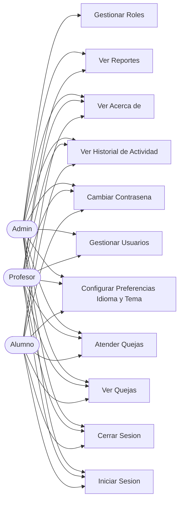

```mermaid
graph LR
    Admin([Admin])
    Profesor([Profesor])
    Alumno([Alumno])

    UC1[Iniciar Sesion]
    UC2[Cerrar Sesion]
    UC3[Gestionar Usuarios]
    UC4[Gestionar Roles]
    UC5[Ver Quejas]
    UC6[Atender Quejas]
    UC7[Ver Reportes]
    UC8[Configurar Preferencias Idioma y Tema]
    UC9[Cambiar Contrasena]
    UC10[Ver Historial de Actividad]
    UC11[Ver Acerca de]

    Admin --> UC1
    Admin --> UC2
    Admin --> UC3
    Admin --> UC4
    Admin --> UC5
    Admin --> UC6
    Admin --> UC7
    Admin --> UC8
    Admin --> UC9
    Admin --> UC10
    Admin --> UC11

    Profesor --> UC1
    Profesor --> UC2
    Profesor --> UC3
    Profesor --> UC5
    Profesor --> UC6
    Profesor --> UC7
    Profesor --> UC8
    Profesor --> UC9
    Profesor --> UC10
    Profesor --> UC11

    Alumno --> UC1
    Alumno --> UC2
    Alumno --> UC5
    Alumno --> UC6
    Alumno --> UC8
    Alumno --> UC9
    Alumno --> UC10
    Alumno --> UC11
```