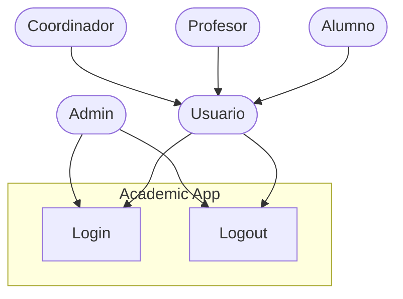

```mermaid
graph TB
    Admin([Admin])
    Coordinador([Coordinador])
    Profesor([Profesor])
    Alumno([Alumno])
    Usuario([Usuario])

    UC1[Login]
    UC2[Logout]

    subgraph "Academic App"
        UC1
        UC2
    end

    Coordinador --> Usuario
    Profesor --> Usuario
    Alumno --> Usuario

    Admin --> UC1
    Admin --> UC2
    Usuario --> UC1
    Usuario --> UC2
```
