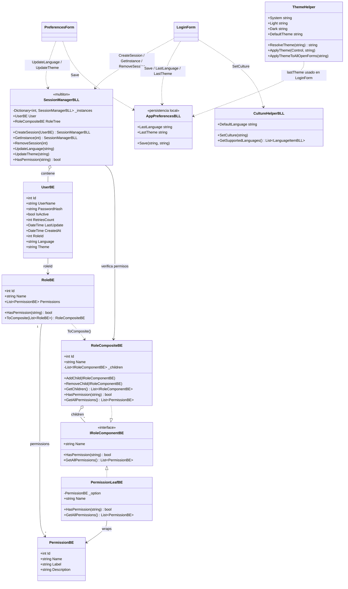

```mermaid
classDiagram
    class UserBE {
        +int Id
        +string UserName
        +string PasswordHash
        +bool IsActive
        +int RetriesCount
        +DateTime LastUpdate
        +DateTime CreatedAt
        +int RoleId
        +string Language
        +string Theme
    }

    class RoleBE {
        +int Id
        +string Name
        +List~PermissionBE~ Permissions
        +HasPermission(string) bool
        +ToComposite(List~RoleBE~) RoleCompositeBE
    }

    class PermissionBE {
        +int Id
        +string Name
        +string Label
        +string Description
    }

    class IRoleComponentBE {
        <<interface>>
        +string Name
        +HasPermission(string) bool
        +GetAllPermissions() List~PermissionBE~
    }

    class RoleCompositeBE {
        +int Id
        +string Name
        -List~IRoleComponentBE~ _children
        +AddChild(IRoleComponentBE)
        +RemoveChild(IRoleComponentBE)
        +GetChildren() List~IRoleComponentBE~
        +HasPermission(string) bool
        +GetAllPermissions() List~PermissionBE~
    }

    class PermissionLeafBE {
        -PermissionBE _option
        +string Name
        +HasPermission(string) bool
        +GetAllPermissions() List~PermissionBE~
    }

    class SessionManagerBLL {
        <<multiton>>
        -Dictionary~int, SessionManagerBLL~ _instances
        +UserBE User
        +RoleCompositeBE RoleTree
        +CreateSession(UserBE) SessionManagerBLL
        +GetInstance(int) SessionManagerBLL
        +RemoveSession(int)
        +UpdateLanguage(string)
        +UpdateTheme(string)
        +HasPermission(string) bool
    }

    class AppPreferencesBLL {
        <<persistencia local>>
        +LastLanguage string
        +LastTheme string
        +Save(string, string)
    }

    class CultureHelperBLL {
        +DefaultLanguage string
        +SetCulture(string)
        +GetSupportedLanguages() List~LanguageItemBLL~
    }

    class ThemeHelper {
        +System string
        +Light string
        +Dark string
        +DefaultTheme string
        +ResolveTheme(string) string
        +ApplyTheme(Control, string)
        +ApplyThemeToAllOpenForms(string)
    }

    UserBE --> RoleBE : roleId
    RoleBE "1" --> "*" PermissionBE : permissions
    RoleBE ..> RoleCompositeBE : ToComposite()
    IRoleComponentBE <|.. RoleCompositeBE
    IRoleComponentBE <|.. PermissionLeafBE
    RoleCompositeBE o-- "*" IRoleComponentBE : children
    PermissionLeafBE --> PermissionBE : wraps

    SessionManagerBLL o-- UserBE : contiene
    SessionManagerBLL --> RoleCompositeBE : verifica permisos
    LoginForm ..> SessionManagerBLL : CreateSession / GetInstance / RemoveSession
    PreferencesForm ..> SessionManagerBLL : UpdateLanguage / UpdateTheme
    LoginForm ..> AppPreferencesBLL : Save / LastLanguage / LastTheme
    PreferencesForm ..> AppPreferencesBLL : Save
    LoginForm ..> CultureHelperBLL : SetCulture
    ThemeHelper ..> AppPreferencesBLL : lastTheme usado en LoginForm
```