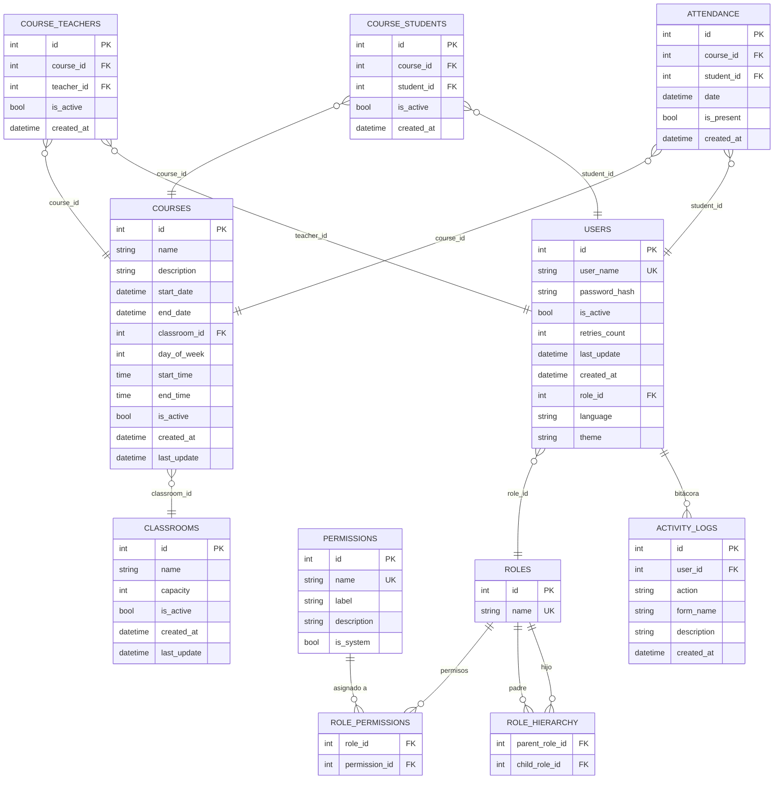

```mermaid
erDiagram
    USERS {
        int id PK
        string user_name UK
        string password_hash
        bool is_active
        int retries_count
        datetime last_update
        datetime created_at
        int role_id FK
        string language
        string theme
    }
    ROLES {
        int id PK
        string name UK
    }
    PERMISSIONS {
        int id PK
        string name UK
        string label
        string description
        bool is_system
    }
    ROLE_PERMISSIONS {
        int role_id FK
        int permission_id FK
    }
    ROLE_HIERARCHY {
        int parent_role_id FK
        int child_role_id FK
    }
    ACTIVITY_LOGS {
        int id PK
        int user_id FK
        string action
        string form_name
        string description
        datetime created_at
    }
    CLASSROOMS {
        int id PK
        string name
        int capacity
        bool is_active
        datetime created_at
        datetime last_update
    }
    COURSES {
        int id PK
        string name
        string description
        datetime start_date
        datetime end_date
        int classroom_id FK
        int day_of_week
        time start_time
        time end_time
        bool is_active
        datetime created_at
        datetime last_update
    }
    COURSE_TEACHERS {
        int id PK
        int course_id FK
        int teacher_id FK
        bool is_active
        datetime created_at
    }
    COURSE_STUDENTS {
        int id PK
        int course_id FK
        int student_id FK
        bool is_active
        datetime created_at
    }
    ATTENDANCE {
        int id PK
        int course_id FK
        int student_id FK
        datetime date
        bool is_present
        datetime created_at
    }

    USERS }o--|| ROLES : "role_id"
    ROLES ||--o{ ROLE_PERMISSIONS : "permisos"
    PERMISSIONS ||--o{ ROLE_PERMISSIONS : "asignado a"
    ROLES ||--o{ ROLE_HIERARCHY : "padre"
    ROLES ||--o{ ROLE_HIERARCHY : "hijo"
    USERS ||--o{ ACTIVITY_LOGS : "bitácora"
    COURSES }o--|| CLASSROOMS : "classroom_id"
    COURSE_TEACHERS }o--|| COURSES : "course_id"
    COURSE_TEACHERS }o--|| USERS : "teacher_id"
    COURSE_STUDENTS }o--|| COURSES : "course_id"
    COURSE_STUDENTS }o--|| USERS : "student_id"
    ATTENDANCE }o--|| COURSES : "course_id"
    ATTENDANCE }o--|| USERS : "student_id"
```
