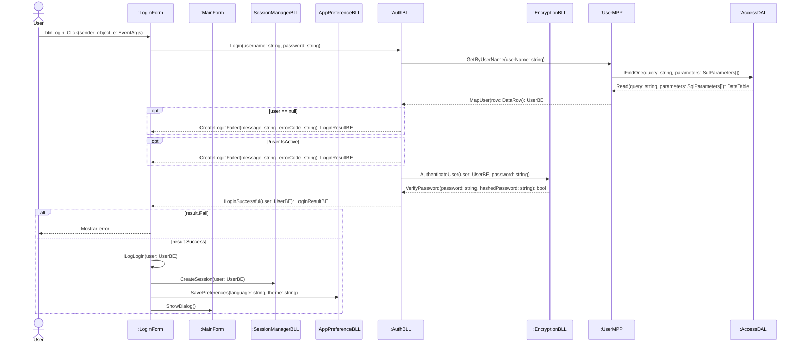

```mermaid
sequenceDiagram
    actor User
    participant LF as :LoginForm
    participant MF as :MainForm
    participant SM as :SessionManagerBLL
    participant AP as :AppPreferenceBLL
    participant Auth as :AuthBLL
    participant Enc as :EncryptionBLL
    participant UMPP as :UserMPP
    participant DAL as :AccessDAL

    User->>LF: btnLogin_Click(sender: object, e: EventArgs)
    LF->>Auth: Login(username: string, password: string)
    Auth->>UMPP: GetByUserName(userName: string)
    UMPP->>DAL: FindOne(query: string, parameters: SqlParameters[])
    DAL-->>UMPP: Read(query: string, parameters: SqlParameters[]): DataTable
    UMPP-->>Auth: MapUser(row: DataRow): UserBE

    opt user == null
        Auth-->>LF: CreateLoginFailed(message: string, errorCode: string): LoginResultBE
    end

    opt !user.IsActive
        Auth-->>LF: CreateLoginFailed(message: string, errorCode: string): LoginResultBE
    end

    Auth->>Enc: AuthenticateUser(user: UserBE, password: string)
    Enc-->>Auth: VerifyPassword(password: string, hashedPassword: string): bool
    Auth-->>LF: LoginSuccessful(user: UserBE): LoginResultBE

    alt result.Fail
        LF-->>User: Mostrar error
    else result.Success
        LF->>LF: LogLogin(user: UserBE)
        LF->>SM: CreateSession(user: UserBE)
        LF->>AP: SavePreferences(language: string, theme: string)
        LF->>MF: ShowDialog()
    end
```
