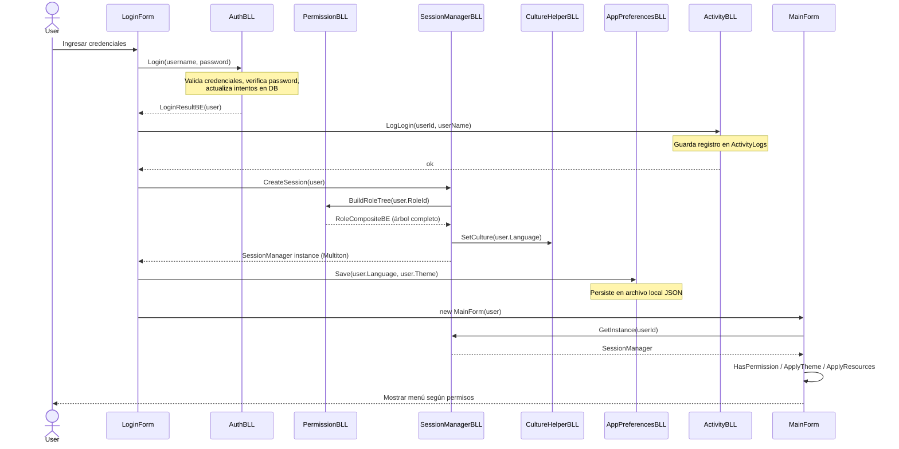

```mermaid
sequenceDiagram
    actor User
    participant LF as LoginForm
    participant Auth as AuthBLL
    participant PBLL as PermissionBLL
    participant SM as SessionManagerBLL
    participant CH as CultureHelperBLL
    participant AP as AppPreferencesBLL
    participant Act as ActivityBLL
    participant MF as MainForm

    User->>LF: Ingresar credenciales
    LF->>Auth: Login(username, password)
    Note over Auth: Valida credenciales, verifica password,<br/>actualiza intentos en DB
    Auth-->>LF: LoginResultBE(user)
    LF->>Act: LogLogin(userId, userName)
    Note over Act: Guarda registro en ActivityLogs
    Act-->>LF: ok
    LF->>SM: CreateSession(user)
    SM->>PBLL: BuildRoleTree(user.RoleId)
    PBLL-->>SM: RoleCompositeBE (árbol completo)
    SM->>CH: SetCulture(user.Language)
    SM-->>LF: SessionManager instance (Multiton)
    LF->>AP: Save(user.Language, user.Theme)
    Note over AP: Persiste en archivo local JSON
    LF->>MF: new MainForm(user)
    MF->>SM: GetInstance(userId)
    SM-->>MF: SessionManager
    MF->>MF: HasPermission / ApplyTheme / ApplyResources
    MF-->>User: Mostrar menú según permisos
```
