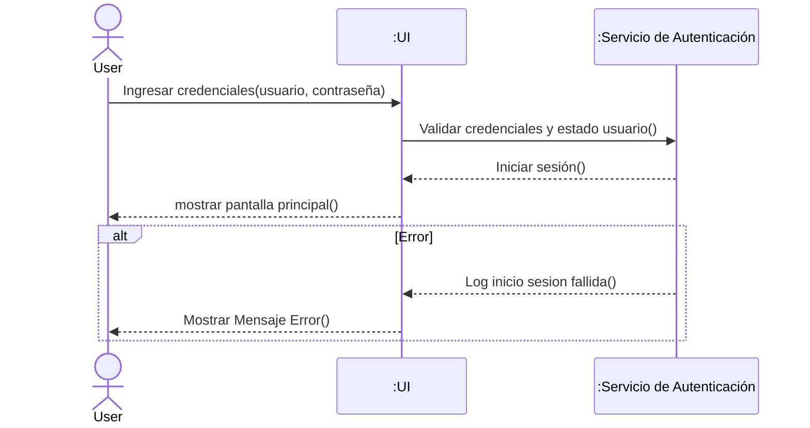

```mermaid
sequenceDiagram
    actor User
    participant UI as :UI
    participant Auth as :Servicio de Autenticación

    User->>UI: Ingresar credenciales(usuario, contraseña)
    UI->>Auth: Validar credenciales y estado usuario()
    Auth-->>UI: Iniciar sesión()
    UI-->>User: mostrar pantalla principal()

    alt Error
        Auth-->>UI: Log inicio sesion fallida()
        UI-->>User: Mostrar Mensaje Error()
    end
```
