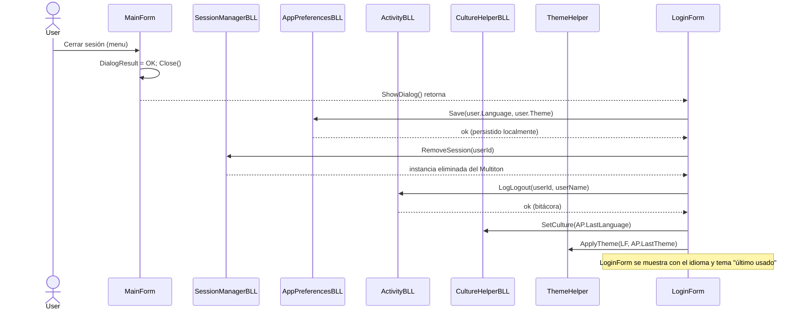

```mermaid
sequenceDiagram
    actor User
    participant MF as MainForm
    participant SM as SessionManagerBLL
    participant AP as AppPreferencesBLL
    participant Act as ActivityBLL
    participant CH as CultureHelperBLL
    participant TH as ThemeHelper
    participant LF as LoginForm

    User->>MF: Cerrar sesión (menu)
    MF->>MF: DialogResult = OK#59; Close()
    MF-->>LF: ShowDialog() retorna
    LF->>AP: Save(user.Language, user.Theme)
    AP-->>LF: ok (persistido localmente)
    LF->>SM: RemoveSession(userId)
    SM-->>LF: instancia eliminada del Multiton
    LF->>Act: LogLogout(userId, userName)
    Act-->>LF: ok (bitácora)
    LF->>CH: SetCulture(AP.LastLanguage)
    LF->>TH: ApplyTheme(LF, AP.LastTheme)
    note over LF: LoginForm se muestra con el idioma y tema "último usado"
```